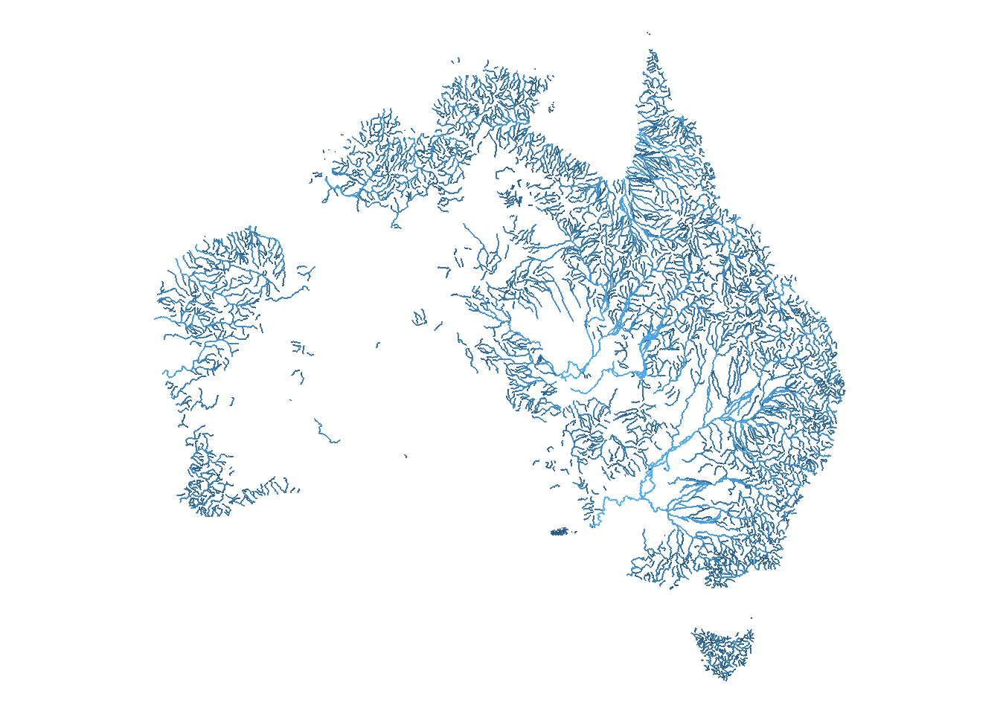
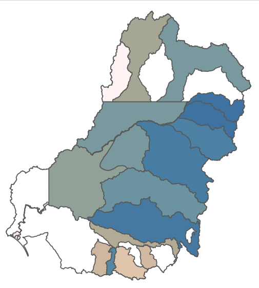
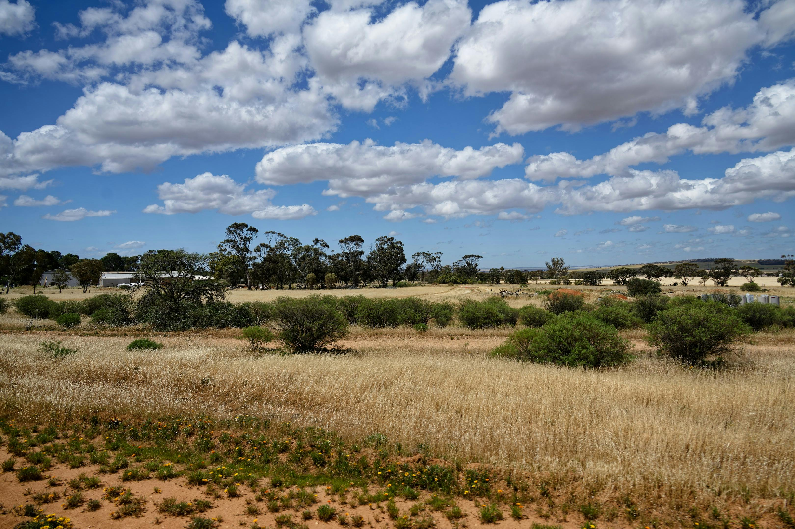

## Our Philosophy & Approach

::: {.callout-important appearance="simple"}
### Science for Real People, Real Problems

We believe that management of agricultural and natural systems and robust science go hand-in-hand. The best environmental science addresses genuine needs and creates measurable positive impacts, while providing a robust basis for decision making on-farm and in natural systems. Our approach emphasizes:

- **Mechanistic understanding** over pattern detection alone
- **Robust projections** under varying scenarios and conditions
- **Identifying uncertainty** and its impact on **risk**
- **Clear communication** to diverse stakeholders
- **Practical applicability** in real-world settings
:::

## Who we are

**Dr Galen Holt** is the founder and director of Confluence Analytics. He is a leading expert in quantitative environmental modelling, with over 15 years experience connecting cutting-edge data analysis and modelling to sustainability, biodiversity, and management outcomes. His work focuses on developing innovative tools that translate complex ecological responses to climate and management interventions into actionable insights for decision-makers. With a strong foundation in ecological theory, spatial-temporal modelling, and user-centric design, Dr Holt has pioneered flexible frameworks that account for uncertainty, nonlinear feedbacks, and landscape heterogeneity—particularly in the context of climate adaptation in agricultural and aquatic systems. His contributions include the HydroBOT Toolkit and the Climate Adaptation Toolkit Workflow, both designed to support strategic planning under climate change. A prolific researcher and collaborator with institutions such as CSIRO, Deakin University, and the Murray-Darling Basin Authority, Dr Holt combines scientific rigour with practical impact, contributing to sustainable land and water management initiatives.

We work closely with **Dr Rebecca Lester** at partner consultancy [Black Swan Insights](https://www.blackswaninsights.com.au/), who brings over 20 years’ of experience at the intersection of environmental science and agriculture. A nationally recognised freshwater ecologist and research leader, she specialises in climate adaptation, sustainable water management, and stakeholder-driven innovation. Dr Lester has led major national initiatives focused on drought resilience and agribusiness, and is accredited in Life Cycle Assessment. Her collaborative approach and strategic insight make her a trusted advisor to government, industry, and community partners working toward resilient, sustainable futures.

:::{.grid}

:::{.g-col-md-8}
## Our Expertise 

We combine deep technical capabilities with specialized methodologies across key domains:

### **Data Science & Mechanistic Modelling**
- Experimental design to ensure the *right* data for the question
- Advanced data acquisition, harmonisation, and big data processing
- Process-based understanding of ecosystem and agrisystem dynamics
- Multi-scale and scenario modelling with uncertainty quantification
- Population dynamics, biodiversity, and climate adaptation analysis

### **Environmental & Water Management**
- Watershed management strategies and integrated ecosystem assessment
- Sustainable agriculture practices and biodiversity conservation
- Development of robust indicators, compliance monitoring
- Cross-system analysis across agricultural, natural, and mixed-use landscapes

### **Communication & Decision Support**
- User-centred design to meet client needs
- Scientific communication and stakeholder engagement
- Interactive dashboards, web apps, and comprehensive reporting
- Training, workshops, and capacity building
:::

::: {.g-col-md-4}
{.section-image fig-alt="Australian rivers"}
:::
:::

::: {.grid}
::: {.g-col-md-6}
{.section-image fig-alt="Watersheds and agriculture"}
:::
:::

## Who We Serve & What Makes Us Different

::: {.grid}
::: {.g-col-md-8}
### **Management Agencies**
We partner with government agencies, NGOs, and regulatory bodies for:
- Protected area management and environmental impact assessment
- Policy development, implementation, and regulatory compliance monitoring

### **Agricultural Operations**  
We support farmers, ranchers, and agricultural companies in:
- Sustainable production practices and water management
- Biodiversity conservation on working lands

### **What sets us apart:**
- **Heterogeneous Systems Expertise**: Excellence across varied landscapes, understanding how management actions scale and interact
- **Mechanism-Based Approach**: Deep understanding of *why* systems respond, enabling reliable predictions
- **Stakeholder-Centered Design**: Every analysis designed for practical decision-making
- **Scale Integration**: Models and outputs designed to capture variability across soils, climate, management, and ecological contexts
:::
::: {.g-col-md-4}
{.section-image fig-alt="Watershed management"}
:::
::: {.g-col-md-4}
{.section-image fig-alt="Agricultural landscape"}
:::
:::

---

*Ready to see how our approach can benefit your organization? [Get in touch](contact.qmd) to discuss your specific needs.*
