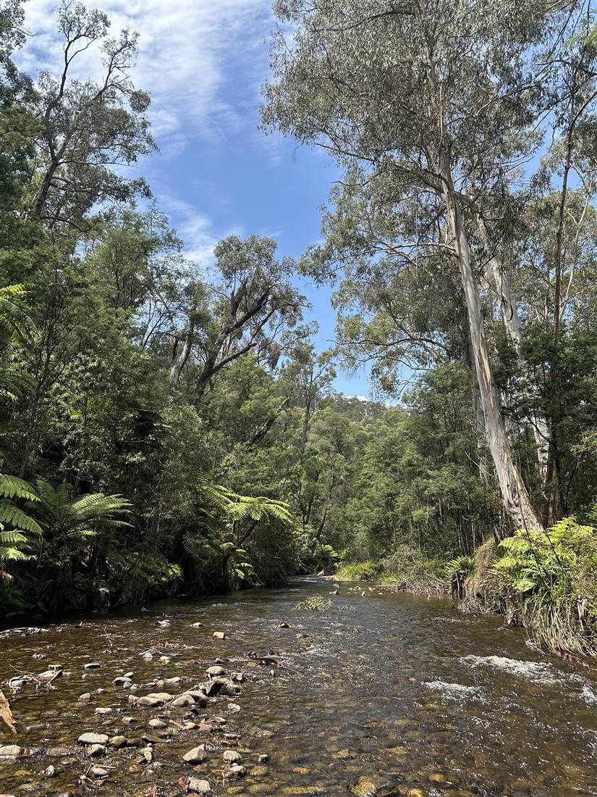

[Confluence Analytics is a Geelong-based consultancy that builds models, analyses and tools for managing water, agriculture and ecosystems. Our clients include government agencies, catchment management authorities and agricultural industry groups.]{.lead}

## How we work

We develop robust models and analyses that target the needs of management decision makers. We work closely with managers so that our outputs are scientifically grounded, interpretable, and push management capabilities forward.

We accentuate scenario modelling and uncertainty. We identify knowledge gaps, assumptions and real environmental variability, so decision makers can see the range of possible outcomes. Our models represent the mechanisms behind ecological and agricultural responses, which makes them more reliable when conditions move outside the historical record.

Our tools follow best practice for reproducible analysis. We document our methods so clients can extend and reuse the work.

## People

::: {.grid}
::: {.g-col-12 .g-col-md-8}
### Dr Galen Holt, Director

Galen is a quantitative ecologist with more than 15 years of experience applying data analysis and modelling to the management of rivers, wetlands and agricultural landscapes. He holds a PhD in quantitative ecology from the University of Arizona and is a Research Fellow at Deakin University's Centre for Regional and Rural Futures.

Galen led development of HydroBOT, the toolkit for assessing climate adaptation in the Murray–Darling Basin. He has published 19 peer-reviewed papers and 17 government reports on biodiversity, environmental flows and climate adaptation.

### Partners

We bring in specialist partners for each project and build the team around the skills the work needs. We work most often with Prof Rebecca Lester of [Black Swan Insights](https://www.blackswaninsights.com.au/), a freshwater ecologist with more than 20 years of experience at the intersection of environmental science and agriculture. Rebecca has led national programs on drought resilience and agribusiness, and she is accredited in Life Cycle Assessment.
:::

::: {.g-col-12 .g-col-md-4}
{.photo .photo-tall fig-alt="A forested upland stream in Victoria"}
:::
:::

## Expertise

::: {.grid .card-grid}

::: {.g-col-12 .g-col-md-4 .service}
### Data and modelling
- Monitoring and experimental design
- Data acquisition and harmonisation, from gauge APIs to remote sensing
- Process-based models of ecosystems and agrisystems
- Scenario modelling and uncertainty quantification
:::

::: {.g-col-12 .g-col-md-4 .service}
### Water and environment
- Environmental flows and catchment assessment
- Fish, waterbirds and wetland vegetation
- Irrigated agriculture and land-use change
- Natural capital
- Indicators and condition assessment
:::

::: {.g-col-12 .g-col-md-4 .service}
### Decision support
- Dashboards, web apps and reporting
- Documented, tested, reproducible software
- Workshops, training and capacity building
:::

:::

## Software

Galen's open-source software includes:

- [HydroBOT](https://mdbauth.github.io/HydroBOT_website/) assesses ecological, social and economic responses to climate change and adaptation in the Murray–Darling Basin.
- [hydrogauge](https://github.com/galenholt/hydrogauge) provides R access to the water-data services run by Australian states.
- [eFlowEval](https://github.com/galenholt/eFlowEval) assesses ecological outcomes of environmental water from wetland to basin scale.

Galen's publications are listed on [ORCID](https://orcid.org/0000-0002-7455-9275).

::: {.cta}
## Talk to us about a project

[Get in touch](contact.qmd){.btn .btn-primary}
:::
