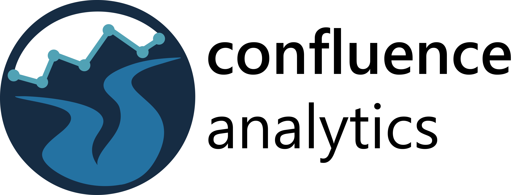
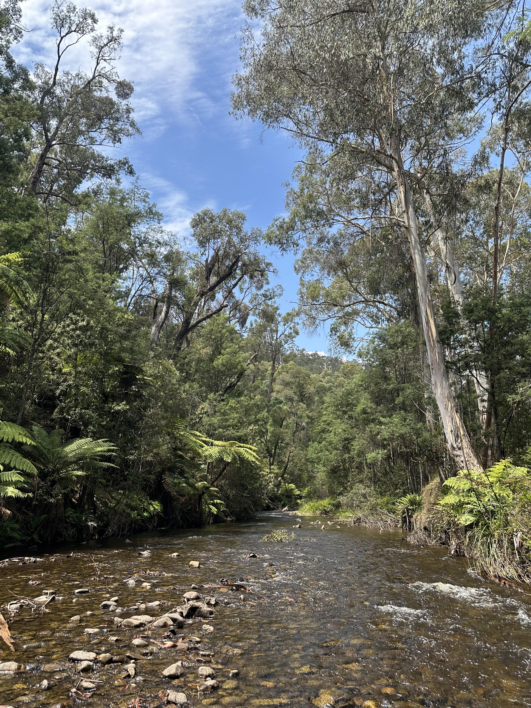
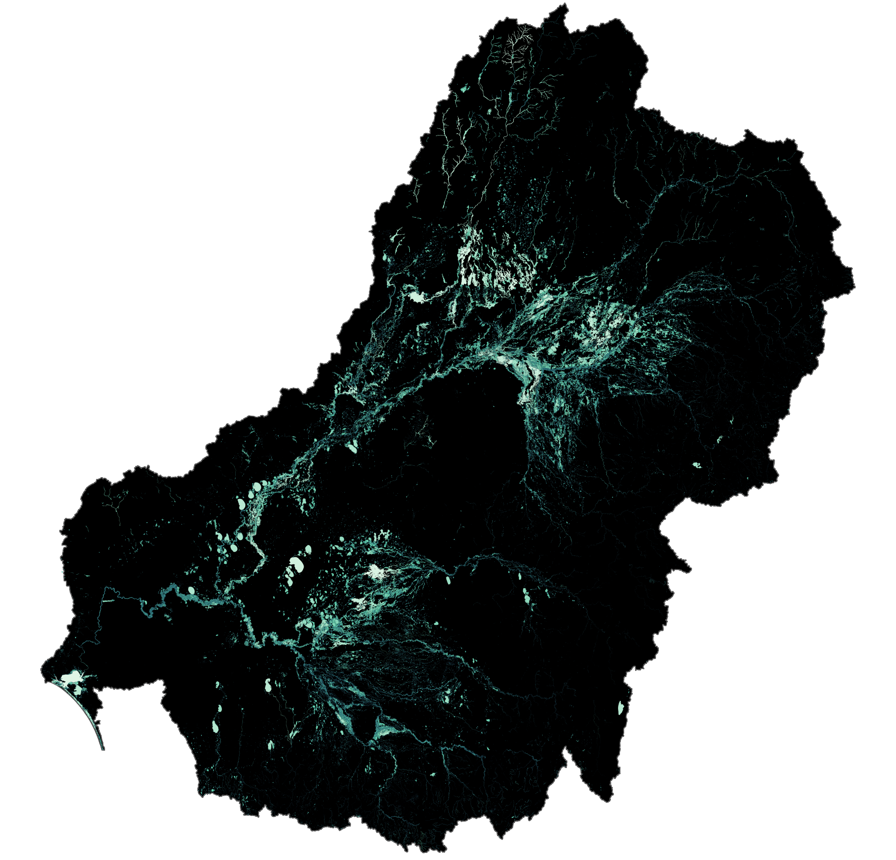

---
format:
  html:
    title-block-banner: false
---

::: {.hero-section}

{.hero-logo width="300" fig-alt="Confluence Analytics Logo"}

## Insights for a complex and changing world

**Confluence Analytics** specializes in ecological and agricultural consulting with a focus on **water management**, **sustainability**, and **biodiversity conservation**. We bridge the gap between complex science and practical management decisions.

:::

## What Sets Us Apart

::: {.grid}
::: {.g-col-md-8}

::: {.grid}

::: {.g-col-md-6 .feature-box}
### **Mechanistic Understanding**
We don't just identify patterns, we understand the underlying mechanisms driving system responses. This approach identifies the *why* and enables more robust projections under different scenarios.
:::

::: {.g-col-md-6 .feature-box}
### **Scale Expertise**  
From local watersheds to regional farming systems and national ecosystems, we excel at modelling complex outcomes across large, heterogeneous systems while maintaining scientific rigour.
:::

::: {.g-col-md-6 .feature-box}
### **Actionable Insights**
Our outputs are scientifically robust yet accessible, designed to be understandable, interpretable, and actionable by managers and non-scientific stakeholders.
:::

::: {.g-col-md-6 .feature-box}
### **Real-World Focus**
We ensure our analysis addresses genuine needs from real people, delivering solutions that make a measurable difference in the field.
:::

:::

:::
::: {.g-col-md-4}
{.section-image fig-alt="Water management and monitoring systems"}

{.section-image fig-alt="Agricultural landscape showing sustainable farming practices"}
:::
:::

## Our Approach

::: {.grid}
::: {.g-col-md-8}

At **Confluence Analytics**, we combine:

- **Advanced data acquisition and analysis** techniques
- **Mechanistic response modelling** at multiple scales
- **Scenario modelling** for robust projections of potential actions and future conditions 
- **Clear communication** of complex scientific findings

:::
::: {.g-col-md-4}
{.section-image fig-alt="Advanced data analysis and modelling techniques"}
:::
:::

::: {.callout-note appearance="simple"}
## Ready to Transform Your Management Strategy?

Whether you're managing agricultural landscapes, conserving biodiversity, or optimizing water resources, we help you make informed decisions backed by solid science.

[Learn More About Our Services](services.qmd){.btn .btn-primary .btn-lg role="button"}
:::

---

### Trusted by Management Agencies and Agricultural Operations

We work with diverse clients who need scientifically-grounded solutions for complex environmental challenges. Our interdisciplinary approach ensures that ecological insights translate into practical management strategies.
